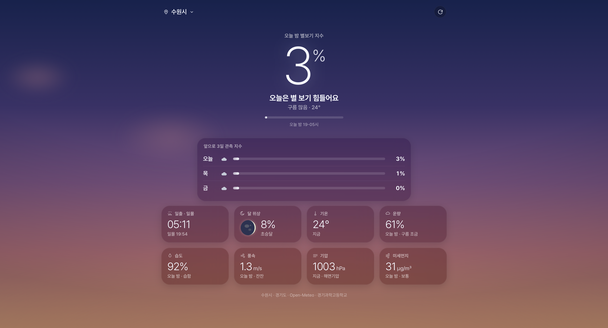

# 별바라기 🌙

오늘 밤의 별 관측 조건을 0–100%로 수치화하는 웹 서비스입니다.
[링크](https://star.wolilab.com)

## 화면

배경은 실시간 날씨와 시각에 따라 14가지 이상의 조합으로 변합니다. 맑은 밤에는 짙은 남보라빛 하늘에 별이 반짝이고, 운량에 따라 별의 밀도가 달라집니다. 구름 낀 날에는 블러 처리된 구름 덩어리가 천천히 흘러갑니다. 일출과 일몰 전후의 황혼 시간대에는 남색에서 보라, 자홍, 주황으로 이어지는 노을 그라데이션이 배경을 채웁니다.

달은 실제로 그립니다. 현재 달의 위상과 밝은 면 비율을 SVG로 정밀하게 렌더링하여 배경에 띄웁니다. 지평선 아래에 있을 때는 표시하지 않으며, 보름에 가까울수록 달무리와 함께 조금 더 크게 나타납니다.

전체 UI는 Apple 날씨 앱의 감성에서 출발했습니다. 관측 지수는 얇은 굵기의 대형 서체로 화면 중앙에 자리하고, 하단의 정보 카드들은 배경 하늘이 비치는 반투명 유리 소재로 처리되었습니다. 폰트는 Pretendard를 사용합니다.

## 주요 기능

예쁜 것이 주요 기능입니다. 첫째로 예쁘고, 둘째로 예쁘고, 셋째로 예쁩니다.

## 잡다한 기능

관측 지수는 오늘 밤(19:00 – 익일 05:00) 예보 구간의 평균값을 기준으로 계산되며, 0–100% 사이의 수치로 표시됩니다. 화면 중앙의 큰 숫자가 그것입니다. 그 아래에는 앞으로 3일간의 관측 지수를 일별로 확인할 수 있습니다.

하단 카드 영역에는 지수에 영향을 주는 요소들을 상세히 표시합니다. 일출·일몰 시각, 달 위상과 밝은 면 비율, 기온, 운량, 습도, 풍속, 기압, 미세먼지(PM₂.5)를 한 화면에서 확인할 수 있습니다. 운량·습도·풍속·미세먼지는 지수 계산에 실제로 쓰인 오늘 밤 평균값을 표시하여 지수와 수치가 항상 일치합니다.

위치를 검색하면 브라우저에 저장되어 다음 방문 시 자동으로 불러옵니다. 별도 회원가입이나 앱 설치 없이 웹 브라우저만으로 동작합니다.

## 관측 지수 계산식

관측 지수 $I$는 다음 수식으로 계산됩니다.

$$I = \max\left(0,\ B - \Delta_{\text{hum}} - \Delta_{\text{pm}} - \Delta_{\text{wind}} - \Delta_{\text{moon}}\right)$$

구름이 점수의 상한을 결정하고, 나머지 요소들이 거기서 점수를 차감하는 구조입니다. 완전히 흐린 날은 다른 조건과 무관하게 0점입니다.

### 기본 점수 B — 운량

$$B = 100 \times \left(1 - \frac{C}{100}\right)^{1.5}$$

$C$는 운량(%)입니다. 지수 1.5를 사용하여 구름이 조금만 끼어도 점수가 가파르게 낮아지도록 설계했습니다. 맑은 하늘(C=0)이면 B=100, 완전히 흐린 하늘(C=100)이면 B=0입니다.

### 습도 페널티 Δhum

$$\Delta_{\text{hum}} = 20 \times \max\left(0,\ \frac{H - 40}{60}\right)^{1.5}$$

$H$는 상대습도(%)입니다. 40% 이하에서는 페널티가 없으며, 100%에서 최대 −20점입니다. 습도가 높으면 대기 중 수증기가 별빛을 산란시키고 렌즈와 경통에 이슬이 맺혀 관측을 방해합니다.

### 미세먼지 페널티 Δpm

$$\Delta_{\text{pm}} = 10 \times \min\left(1,\ \frac{\text{PM}_{2.5}}{75}\right)^{0.8}$$

PM₂.5 기준입니다. 지수 0.8을 사용하여 낮은 농도에서도 민감하게 반응하도록 했습니다. 75 ㎍/㎥ 이상에서 최대 −10점입니다.

### 풍속 페널티 Δwind

$$\Delta_{\text{wind}} = 7 \times \text{clamp}\left(\left(\frac{W - 3}{12}\right)^2,\ 0,\ 1\right)$$

$W$는 풍속(m/s)입니다. 3 m/s 이하에서는 페널티가 없으며, 15 m/s 이상에서 최대 −7점입니다. 강풍은 망원경의 상을 흔들어 장노출 관측을 어렵게 합니다.

### 달빛 페널티 Δmoon

$$\Delta_{\text{moon}} = 8 \times f \times \frac{1}{N}\sum_{t} \max\left(0,\ \sin\theta_t\right)$$

$f$는 달의 밝은 면 비율(0–1), $\theta_t$는 30분 간격으로 샘플링한 달의 고도각(라디안)입니다. $\sin\theta$를 사용하여 지평선 부근의 달은 대기 소광으로 영향이 적고, 천정에 가까울수록 크게 불이익을 받도록 했습니다. 최대 −8점입니다.

## 데이터 출처

|---|---|
| [Open-Meteo](https://open-meteo.com) | 운량, 습도, 풍속, 기압, 기온, PM₂.5 |
| [SunCalc](https://github.com/mourner/suncalc) | 달 위상, 밝은 면 비율, 고도각 |
| [Nominatim](https://nominatim.org) (OpenStreetMap) | 위치 검색 |
